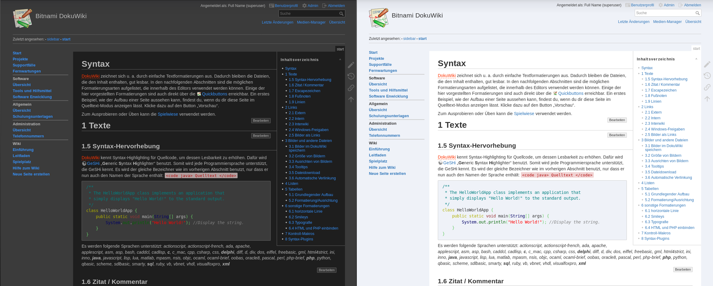

# MindTheDark Template
This template is based on the standard [DokuWiki Template](https://www.dokuwiki.org/template:dokuwiki).

MindTheDark offers a light and a dark color scheme for your DokuWiki. The color scheme and the style are optimized for software documentation. The optics are flat.

If the `userCoice` option is enabled, an option to change the color scheme will appear in the header.

If the `autoDark` option is enabled, the color scheme of the operating system is used. 

If neither of the two options is selected, a static color scheme can be selected via `theme`.

## Features
* light and a dark color scheme (`theme` option in Configuration Manager)
* automatic color scheme depending on operating system settings (`autoDark` option in Configuration Manager)
* change of the color scheme by the user (`userCoice` option in Configuration Manager)
* all colors of the light and dark color scheme can be set in the Configuration Manager
* and all features the standard [DokuWiki Template](https://www.dokuwiki.org/template:dokuwiki#features) offers

## Customizing
The MindTheDark Template offers all customizing like the standard [DokuWiki Template](https://www.dokuwiki.org/template:dokuwiki#customizing).

### Changing Styles
Additionally to the standard guaranteed [style.ini](https://www.dokuwiki.org/devel:style.ini) placeholders and the standard [DokuWiki Template customizing](https://www.dokuwiki.org/template:dokuwiki#customizing), the template uses the following variables: 

| placeholder variable | meaning |
|----------------------|---------|
| `__pre_text__`         | text color of inline code formating|
| `__pre_background__`   | backgroung color of inline code formating|

## Localization
The texts are translated into German and English. Contributions are welcome.

## Status
For now I consider this template as `beta` for the following reasons: 
* not heavily tested, especially not on different browsers
* not tested on mobiles
* still under construction

Issues and improvements can be reported [here](https://github.com/MrReSc/MindTheDark).

## Installation

Refer to [template](https://www.dokuwiki.org/template) on how to install and use templates in DokuWiki.

## Remarks
The `autoDark` option only works with modern browsers. The compatibility can be checked [here](https://caniuse.com/#feat=prefers-color-scheme).