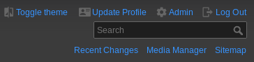
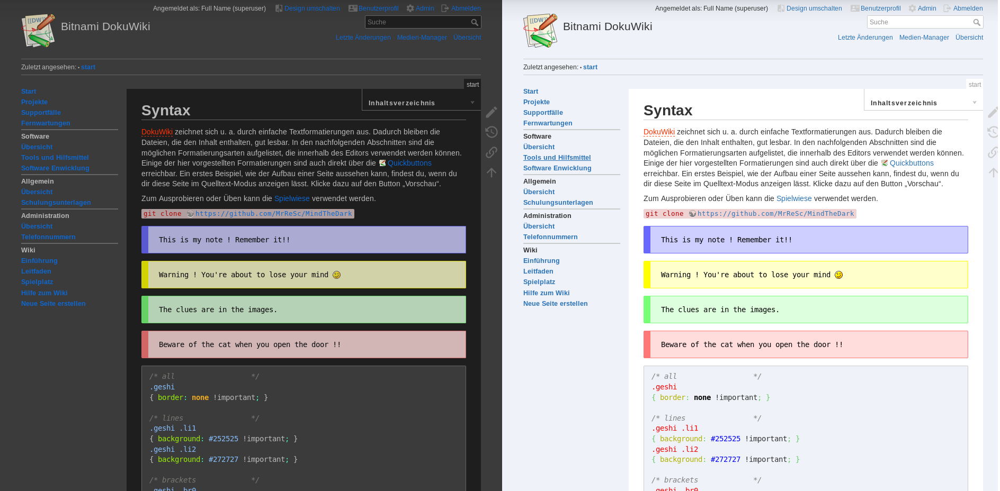
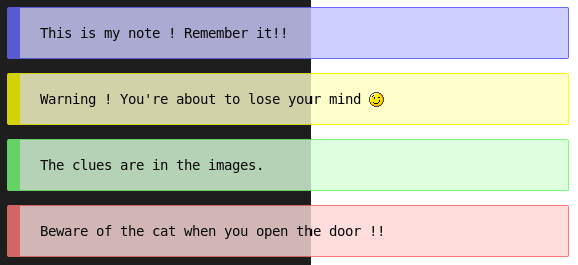

# MindTheDark Template
This template is based on the standard [DokuWiki Template](https://www.dokuwiki.org/template:dokuwiki).

MindTheDark offers a light and a dark color scheme for your DokuWiki. The color scheme and the style are optimized for software documentation. The optics are flat.

If the `userChoice` option is enabled, an option to change the color scheme will appear in the header.

If the `autoDark` option is enabled, the color scheme of the operating system is used. 

If neither of the two options is selected, a static color scheme can be selected via `theme`.

## Features
* light and a dark color scheme (`theme` option in Configuration Manager)
* automatic color scheme depending on operating system settings (`autoDark` option in Configuration Manager)
* change of the color scheme by the user (`userChoice` option in Configuration Manager)
* all colors of the light and dark color scheme can be set in the Configuration Manager
* and all features the standard [DokuWiki Template](https://www.dokuwiki.org/template:dokuwiki#features) offers
* light and dark color theme for syntax highlighting in GeShi (thx @pv2b, @asfethan)

## Plugin Support
### Note Plugin
If [Note Plugin](https://www.dokuwiki.org/plugin:note) is installed you can activate the support with the option `pluginNote` in the configuration manager. If the option `pluginNote` is enabled, the base colors of the notes can also be changed.

## Customizing
The MindTheDark Template offers all customizing like the standard [DokuWiki Template](https://www.dokuwiki.org/template:dokuwiki#customizing).

### Changing Styles
Additionally to the standard guaranteed [style.ini](https://www.dokuwiki.org/devel:style.ini) placeholders and the standard [DokuWiki Template customizing](https://www.dokuwiki.org/template:dokuwiki#customizing), the template uses the following variables: 

| placeholder variable | meaning |
|----------------------|---------|
| `__pre_text_color__`                  | text color of inline code formating|
| `__pre_background_color__`            | backgroung color of inline code formating|
| `__selection_color__`                 | text color of selection|
| `__selection_background_color__`      | backgroung color of selection|
| `__scrollbar_track__`                 | color of the scrollbar|
| `__scrollbar_thumb__`                 | color of the scrollbar button|
| `__note_plugin_classic_color__`       | base color for note plugin `<classic>`|
| `__note_plugin_important_color__`     | base color for note plugin `<important>`|
| `__note_plugin_warning_color__`       | base color for note plugin `<warning>`|
| `__note_plugin_tip_color__`           | base color for note plugin `<tip>`|

## Localization
The texts are translated into German and English. Contributions are welcome.

## Status
The plugin is currently used in about ~1% of DokuWiki installations. Almost no problems are reported. The current version is stable.

Issues and improvements can be reported [here](https://github.com/MrReSc/MindTheDark).

[MindTheDark popularity](https://dokuwiki.org/lib/plugins/pluginrepo/popularity.php?key=conf_template&output=pie&limit=8&d=20&x=.png)

## Installation

Refer to [template](https://www.dokuwiki.org/template) on how to install and use templates in DokuWiki.

## Remarks
* The `autoDark` option only works with modern browsers. The compatibility can be checked [here](https://caniuse.com/#feat=prefers-color-scheme).
* GeShi dark mode style sheet provided by @asfethan [https://cyberasylum.eu/how-to-change-geshi-stylesheet](https://cyberasylum.eu/how-to-change-geshi-stylesheet)